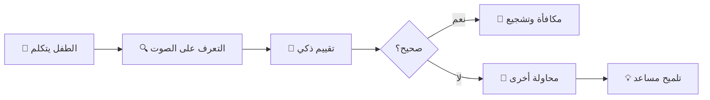

<div align="center">

# 🤖 BMO Kids - نظام تعليمي تفاعلي صوتي


### صديقك الذكي في رحلة التعلم 🌟

[](https://dotnet.microsoft.com/)
[](https://dotnet.microsoft.com/apps/aspnet/web-apps/blazor)
[](LICENSE)
[](https://github.com/Omartube70/BmoKids)

</div>

---

## 📖 جدول المحتويات

- [نظرة عامة](#-نظرة-عامة)
- [المميزات الرئيسية](#-المميزات-الرئيسية)
- [معرض الصور](#-معرض-الصور)
- [التقنيات المستخدمة](#-التقنيات-المستخدمة)
- [البدء السريع](#-البدء-السريع)
- [الهيكل التقني](#-الهيكل-التقني)
- [الأقسام التعليمية](#-الأقسام-التعليمية)
- [واجهة المستخدم](#-واجهة-المستخدم)
- [دليل التطوير](#-دليل-التطوير)
- [الإعدادات والتخصيص](#-الإعدادات-والتخصيص)
- [الاختبار](#-الاختبار)
- [المساهمة](#-المساهمة)
- [الدعم](#-الدعم)

---

## 🌟 نظرة عامة

**BMO Kids** هو نظام تعليمي تفاعلي متطور مصمم خصيصًا للأطفال من عمر **3-12 سنة**. يستخدم التطبيق أحدث تقنيات الذكاء الاصطناعي والتعرف على الصوت لتوفير تجربة تعليمية فريدة وممتعة.

<div align="center">

### 🎯 الهدف الأساسي

**تحويل التعلم إلى مغامرة تفاعلية ممتعة بدون الحاجة لأي كتابة!**

</div>

### ✨ لماذا BMO Kids؟

| الميزة | الوصف |
|--------|--------|
| 🎤 **تفاعل صوتي 100%** | لا حاجة للكتابة - كل شيء بالصوت |
| 🤖 **شخصية BMO المحبوبة** | صديق افتراضي يتفاعل ويشجع |
| 📊 **تتبع دقيق** | إحصائيات تفصيلية عن تقدم الطفل |
| 🎨 **واجهة جذابة** | ألوان زاهية ورسوم متحركة |
| 🔒 **خصوصية تامة** | كل البيانات محلية - لا سحابة |
| 🌐 **دعم متعدد اللغات** | عربي وإنجليزي |

---

## 🎁 المميزات الرئيسية

### 1️⃣ نظام التعرف الصوتي الذكي



**التقنيات المستخدمة:**
- ✅ Web Speech API للتعرف الفوري
- ✅ Levenshtein Distance للمقارنة اللفظية
- ✅ Confidence Scoring متقدم
- ✅ تكيف مع عمر الطفل

### 2️⃣ وجه BMO التفاعلي 🤖

<div align="center">

</div>

**التعبيرات المتاحة:**
- 😊 سعيد - عند الإجابة الصحيحة
- 🤔 متفكر - أثناء الانتظار
- 😮 متحدث - أثناء النطق
- 😢 حزين - عند الخطأ
- 🎉 احتفالي - عند النجاح

### 3️⃣ الأقسام التعليمية

<table>
<tr>
<td width="25%" align="center">

<h4>🔤 الإنجليزية</h4>
<p>تعلم الأحرف A-Z</p>
</td>
<td width="25%" align="center">

<h4>أ العربية</h4>
<p>تعلم الحروف العربية</p>
</td>
<td width="25%" align="center">

<h4>🔢 الأرقام</h4>
<p>الأرقام من 1-20</p>
</td>
<td width="25%" align="center">

<h4>💬 المحادثة</h4>
<p>تحدث مع BMO</p>
</td>
</tr>
</table>

### 4️⃣ لوحة تحكم الوالدين 📊

<div align="center">

</div>

**البيانات المتاحة:**
- 📈 عدد الجلسات التعليمية
- ✅ الإجابات الصحيحة
- ❌ الإجابات الخاطئة
- 📊 نسبة النجاح الإجمالية
- 📝 سجل كامل بالأنشطة
- 📥 تصدير البيانات JSON

---

## 🖼️ معرض الصور

<div align="center">

### شاشة الترحيب


### اختيار القسم


### جلسة التعلم


</div>

---

## 🛠️ التقنيات المستخدمة

<div align="center">

### Backend


### Frontend


### APIs


</div>

---

## 🚀 البدء السريع

### المتطلبات الأساسية

```bash
# تحقق من تثبيت .NET 10
dotnet --version
# يجب أن يظهر: 10.0.0 أو أحدث
```

### خطوات التثبيت

#### 1️⃣ استنساخ المشروع

```bash
git clone https://github.com/Omartube70/BmoKids.git
cd BmoKids
```

#### 2️⃣ استعادة الحزم

```bash
dotnet restore
```

#### 3️⃣ تشغيل التطبيق

```bash
dotnet run
```

#### 4️⃣ فتح المتصفح

افتح المتصفح وانتقل إلى:
```
https://localhost:7286
```

### ⚡ تشغيل سريع - خطوة واحدة

```bash
git clone https://github.com/Omartube70/BmoKids.git && cd BmoKids && dotnet run
```

---

## 🏗️ الهيكل التقني

```
BmoKids/
│
├── 📁 BmoImages/                    # صور BMO والشخصية
│   ├── WhatsApp Image (1).jpeg
│   ├── WhatsApp Image (2).jpeg
│   └── ...
│
├── 📁 Components/                   # مكونات Blazor
│   ├── 📁 Pages/
│   │   └── Home.razor              # الصفحة الرئيسية
│   ├── App.razor                   # التطبيق الرئيسي
│   ├── BMOFace.razor               # وجه BMO المتحرك
│   ├── WelcomeScreen.razor         # شاشة الترحيب
│   ├── NameInput.razor             # إدخال الاسم صوتيًا
│   ├── SectionSelector.razor       # اختيار القسم
│   ├── LearningSession.razor       # جلسة التعلم
│   └── ParentDashboard.razor       # لوحة الوالدين
│
├── 📁 Services/                    # الخدمات الخلفية
│   ├── 📁 LocalStorage/
│   │   ├── IStorageService.cs
│   │   ├── LocalStorageService.cs
│   │   ├── DataStorageService.cs
│   │   ├── SettingsStorageService.cs
│   │   └── CacheStorageService.cs
│   ├── SpeechService.cs            # خدمة التعرف الصوتي
│   └── AssessmentService.cs        # خدمة المحتوى التعليمي
│
├── 📁 Models/                      # نماذج البيانات
│   └── ChildData.cs
│
├── 📁 wwwroot/                     # الموارد الثابتة
│   ├── 📁 css/
│   │   └── app.css                 # التصميم الكامل
│   ├── 📁 js/
│   │   └── bmokids.js              # Web Speech Integration
│   └── favicon.png
│
├── 📁 Documentation/               # التوثيق
│   ├── README.md
│   ├── QUICKSTART.md
│   └── PROJECT_STRUCTURE.md
│
├── Program.cs                      # نقطة البداية
├── appsettings.json                # الإعدادات
└── BmoKids.csproj                  # ملف المشروع
```

---

## 📚 الأقسام التعليمية

### 🔤 قسم الإنجليزية

**المحتوى:**
- 26 حرف (A-Z)
- نطق صحيح لكل حرف
- أمثلة صوتية واضحة

**آلية التعلم:**
1. عرض الحرف (3 ثوانٍ)
2. BMO ينطق الحرف
3. الطفل يكرر
4. تقييم فوري
5. تغذية راجعة

### أ قسم العربية

**المحتوى:**
- 28 حرف عربي
- أسماء الحروف الصحيحة
- تمييز بين الأشكال المختلفة

### 🔢 قسم الأرقام

**المحتوى:**
- الأرقام من 1-20
- نطق عربي وإنجليزي
- تطبيقات عملية

### 💬 قسم المحادثة

**قريبًا!** 🚧
- محادثات حرة مع BMO
- أسئلة وأجوبة
- ألعاب تفاعلية

---

## 🎨 واجهة المستخدم

### نظام الألوان

```css
:root {
    --primary-color: #90EE90;      /* أخضر BMO */
    --primary-dark: #2d5016;       /* أخضر داكن */
    --success-color: #4CAF50;      /* أخضر النجاح */
    --error-color: #f44336;        /* أحمر الخطأ */
    --warning-color: #ff9800;      /* برتقالي التحذير */
    --bg-gradient: linear-gradient(135deg, #667eea 0%, #764ba2 100%);
}
```

### الرسوم المتحركة

**التأثيرات المتاحة:**
- ✨ Fade In - ظهور تدريجي
- 🌊 Pulse - نبض
- 🎉 Success Pulse - نبض النجاح
- 🤝 Shake - اهتزاز
- 🎈 Float - طفو
- 👁️ Blink - رمش العين
- 💗 Heart Beat - نبض القلب

---

## 👨‍💻 دليل التطوير

### إضافة قسم تعليمي جديد

```csharp
// في AssessmentService.cs
public List<LessonItem> GetNewSection()
{
    var items = new List<LessonItem>();
    
    // أضف العناصر التعليمية
    items.Add(new LessonItem
    {
        Value = "المحتوى",
        DisplayText = "النص المعروض",
        AcceptedPronunciations = new List<string> { "نطق1", "نطق2" },
        TeachingText = "نص التعليم",
        Language = "ar-EG"
    });
    
    return items;
}
```

### إضافة تعبير جديد لـ BMO

```csharp
// في BMOFace.razor
public enum MouthState
{
    Neutral,
    Closed,
    Happy,     // ← جديد
    Excited    // ← جديد
}
```

### تخصيص التقييم

```csharp
// في appsettings.json
"ConfidenceThresholds": {
  "Age3to5": 0.28,    // أطفال صغار - تساهل أكبر
  "Age6to8": 0.35,    // متوسط
  "Age9to12": 0.45    // كبار - دقة أعلى
}
```

---

## ⚙️ الإعدادات والتخصيص

### تعديل سرعة النطق

```javascript
// في bmokids.js
utterance.rate = 0.95;  // 0.5 (بطيء) - 2.0 (سريع)
```

### تعديل مدة الاستماع

```javascript
// في bmokids.js
recognizeSpeech: function (lang = 'ar-EG', timeout = 5000) {
    // timeout بالميلي ثانية
}
```

### تخصيص الألوان

```css
/* في app.css */
:root {
    --primary-color: #your-color;
}
```

---

## 🧪 الاختبار

### اختبار التعرف الصوتي

```bash
# افتح Console في المتصفح
BmoKids.recognizeSpeech('ar-EG', 5000)
  .then(result => console.log('نتيجة:', result))
  .catch(error => console.error('خطأ:', error));
```

### اختبار النطق

```bash
BmoKids.speak('مرحباً', 'ar-EG', 0.95, 1.0);
```

### اختبار localStorage

```bash
# حفظ
localStorage.setItem('test', 'value');

# قراءة
localStorage.getItem('test');

# حذف
localStorage.removeItem('test');
```

---

## 🤝 المساهمة

نرحب بمساهماتك! 🎉

### خطوات المساهمة

1. **Fork المشروع**
   ```bash
   git clone https://github.com/your-username/BmoKids.git
   ```

2. **إنشاء branch جديد**
   ```bash
   git checkout -b feature/amazing-feature
   ```

3. **Commit التغييرات**
   ```bash
   git commit -m 'إضافة ميزة رائعة'
   ```

4. **Push للـ branch**
   ```bash
   git push origin feature/amazing-feature
   ```

5. **فتح Pull Request**

### معايير الكود

- ✅ استخدم أسماء واضحة ومعبرة
- ✅ أضف تعليقات للكود المعقد
- ✅ اتبع نمط الكود الحالي
- ✅ اكتب اختبارات للميزات الجديدة
- ✅ حدّث التوثيق

---

## 💬 الدعم

### طرق التواصل

- 📧 **البريد الإلكتروني:** support@bmokids.com
- 🐛 **المشاكل:** [GitHub Issues](https://github.com/Omartube70/BmoKids/issues)
- 📖 **الوثائق:** [Wiki](https://github.com/Omartube70/BmoKids/wiki)
- 💬 **المناقشات:** [Discussions](https://github.com/Omartube70/BmoKids/discussions)

### الأسئلة الشائعة

<details>
<summary><b>لماذا لا يعمل المايكروفون؟</b></summary>

تأكد من:
- ✅ استخدام HTTPS
- ✅ منح إذن المايكروفون
- ✅ استخدام Chrome أو Edge
</details>

<details>
<summary><b>كيف أصدّر بيانات طفلي؟</b></summary>

1. اضغط زر "👤 ولي الأمر"
2. اضغط "📤 تصدير البيانات"
3. احفظ ملف JSON
</details>

<details>
<summary><b>هل يعمل التطبيق offline؟</b></summary>

نعم! كل البيانات محلية في localStorage
</details>

---

## 📜 الترخيص

هذا المشروع مرخص تحت **MIT License** - انظر ملف [LICENSE](LICENSE) للتفاصيل.

```
MIT License

Copyright (c) 2025 BMO Kids

Permission is hereby granted, free of charge, to any person obtaining a copy
of this software and associated documentation files (the "Software"), to deal
in the Software without restriction...
```

---

## 🌟 شكر خاص

- 🙏 **فريق .NET** - على Blazor الرائع
- 🎤 **Web Speech API** - على التقنية المذهلة
- 🤖 **Adventure Time** - على شخصية BMO المحبوبة
- ❤️ **المجتمع** - على الدعم والتشجيع

---

## 📊 إحصائيات المشروع

<div align="center">


</div>

---

## 🗺️ خارطة الطريق

### ✅ المنجز
- [x] نظام التعرف الصوتي
- [x] وجه BMO التفاعلي
- [x] 3 أقسام تعليمية
- [x] لوحة تحكم الوالدين
- [x] تخزين محلي

### 🚧 قيد التطوير
- [ ] قسم المحادثة الحرة
- [ ] نظام المكافآت
- [ ] وضع اللعب الجماعي

### 🔮 المستقبل
- [ ] تطبيق موبايل (PWA)
- [ ] دعم المزيد من اللغات
- [ ] التكامل مع Firebase
- [ ] تحسينات ML/AI

---

<div align="center">

### 💖 صُنع بحب لأطفالنا

**BMO Kids** © 2025

[⬆️ العودة للأعلى](#-bmo-kids---نظام-تعليمي-تفاعلي-صوتي)

</div>